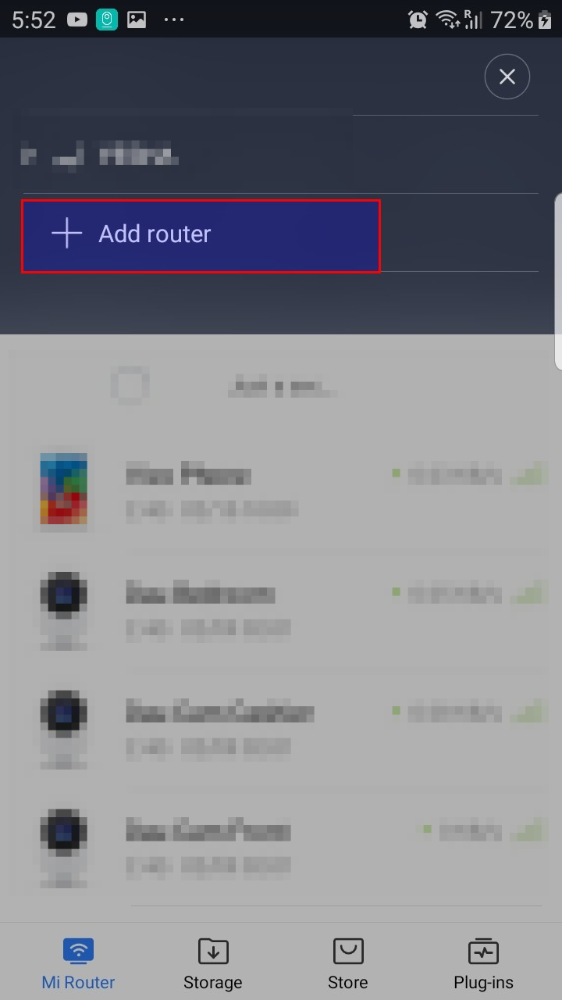

# MI Router 3
This will aid you on how to resolve the pairing issue of MI WIFI app in MI Router 3

# Procedure

1. First you need to manually downgrade your MI Router 3 firmware to 2.10.38 version you can find the firmware here (miwifi_r3_firmware_62cf9_2.10.38_INT.bin)

Step 1

Step 2

Step 3

2. Unpair the MI Router 3 on your MI WIFI app.

3. Setup your router using 2.10.38 version

Step 1 - setup SSID and password

Step 2 - check the Same as wifi password

Step 3 - click router admin page
 

Step 4 - Click settings and select People's Republic of China as locale

4. Pair the MI Router 3 to your MI WIFI app on your cellphone

Step 1 - Open your MI WIFI App and select the Add router and wait

Step 2 - click pair router and wait

5. Upgrade the MI Router 3 to latest versionb

